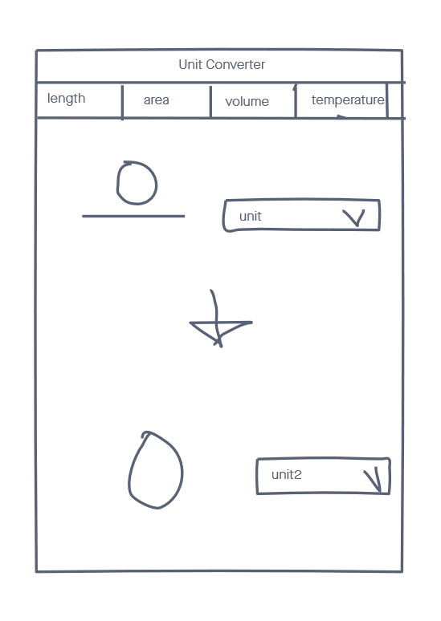
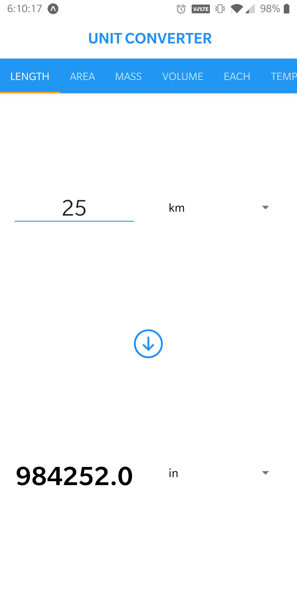

# Unit Converter

A basic react-native app that uses expo and other react libraries that converts a user input unit to unit of choice. Large variety of units to choose from.

## Technologies

- React
- React-Native
- Expo

## Dependencies

- react-native-tab-view
- @react-native-community/picker
- convert-units
- expo-constants
- @expo/vector-icons

## Wireframe

## Actual App

## Getting Started

[Click Here](https://expo.io/@cameron2/projects/unit-converter) to see the expo app page!
